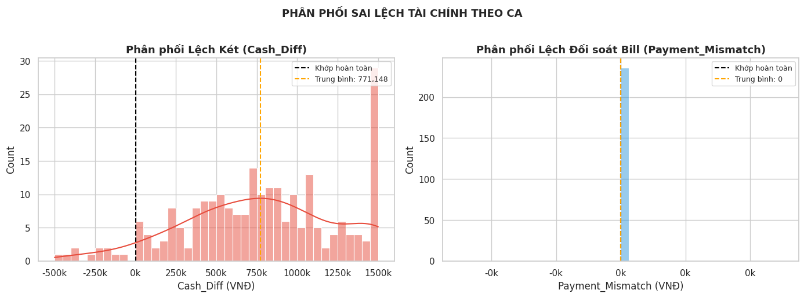
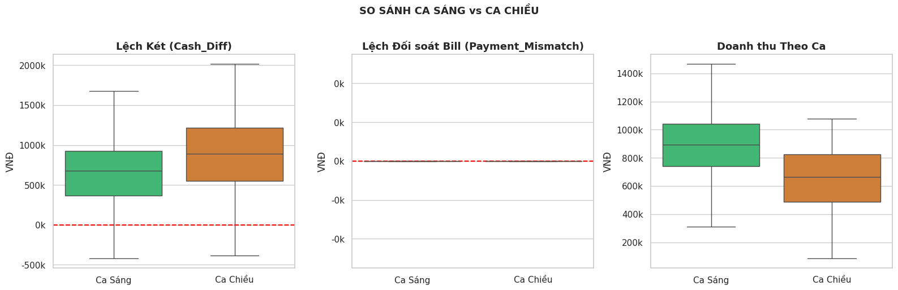
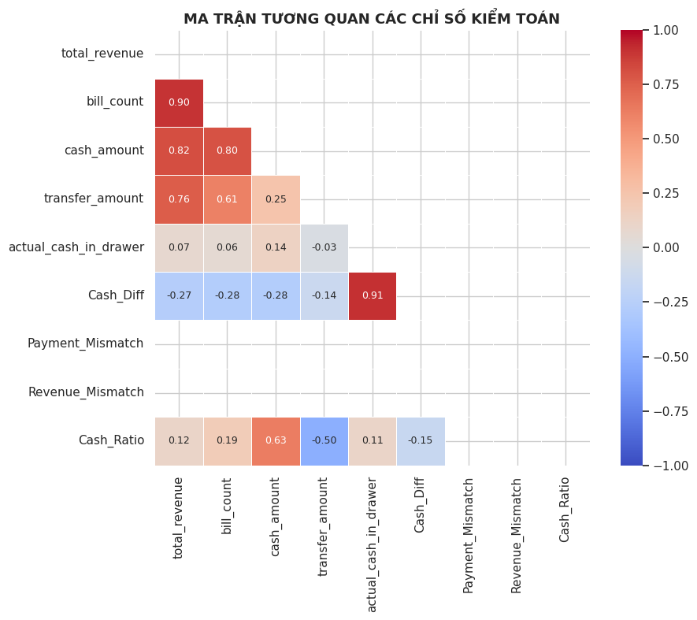
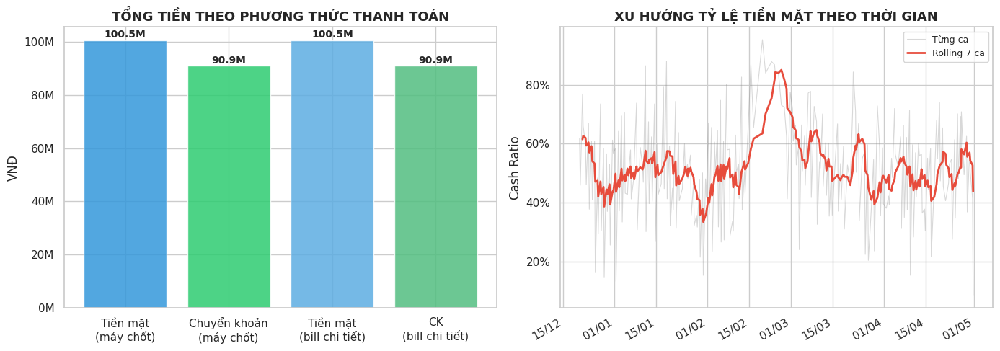

# Giải thích Vòng 1 — Descriptive Analysis
### "Thằng không có não cũng hiểu"

---

## 🗺️ Bản đồ nhanh: 5 hình này đang hỏi gì?

| Hình | Câu hỏi đang trả lời |
|------|----------------------|
| histogram-kde | Ca làm việc lệch tiền nhiều không? Lệch về hướng nào? |
| scatter-plot | Có ca nào bấm nhầm loại tiền không? |
| boxplot | Ca Sáng và Ca Chiều có khác nhau không? |
| correlation-heatmap | Các con số trong sổ sách có liên quan gì nhau không? |
| histogram-timeseries | Tiền mặt và chuyển khoản có khớp giữa máy và bill không? Tỷ lệ tiền mặt thay đổi theo thời gian ra sao? |

---

## Hình 1 — `histogram-kde.png`
### Phân phối Sai lệch Tài chính Theo Ca

**Đây là hình gì?**
Hai biểu đồ cột (histogram) đặt cạnh nhau. Trục ngang là số tiền, trục dọc là số lượng ca rơi vào khoảng đó.



**Hình trái — Phân phối Lệch Két (Cash_Diff):**

Hãy tưởng tượng 236 ca làm việc. Cuối mỗi ca, nhân viên đếm tiền trong két rồi nhập vào máy. Máy tính ra một con số riêng. Hiệu số giữa hai con số đó = `Cash_Diff`.

- Đường đứt đen = mốc 0 (két khớp hoàn toàn)
- Đường cam = trung bình thực tế = **771.148đ**
- **Toàn bộ đống cột nằm về phía phải mốc 0** → hầu hết các ca đều **dư tiền** trong két, không phải hụt tiền
- Đỉnh cột cao nhất nằm ở khoảng 1.250k–1.500k → khoảng tiền dư phổ biến nhất là 1–1,5 triệu/ca
- Có một số ít ca âm (cột lẻ bên trái mốc đen) → hụt tiền, số lượng ít hơn nhiều

> **Hiểu nôm na:** Cứ mỗi ca làm việc, két thường thừa ra khoảng 700k–1,5 triệu. Không phải vì ai lấy tiền vào két, mà vì tiền từ ca trước chưa được nộp lên, cứ để dồn lại.

**Hình phải — Phân phối Lệch Đối soát Bill (Payment_Mismatch):**

- Chỉ có **một cột duy nhất**, dựng đứng tại x = 0, cao tới hơn **200 ca**
- Không có cột nào ở bất kỳ vị trí nào khác
- Trục ngang ghi "−0k ... 0k ... 0k" → toàn bộ giá trị = 0

> **Hiểu nôm na:** Kiểm tra xem nhân viên có bấm nhầm "Tiền mặt" thành "Chuyển khoản" hay không. Kết quả: **không có ca nào bấm nhầm**. Tất cả 236 ca đều khớp hoàn toàn ở cấp hóa đơn. Cột trông như cái cọc đóng xuống đất vì tất cả đều dồn về một điểm duy nhất = 0.

---

## Hình 2 — `scatter-plot.png`
### Phân loại Ca theo Chiều Lệch: Cash_Diff × Payment_Mismatch

**Đây là hình gì?**
Biểu đồ điểm (scatter plot). Mỗi chấm = 1 ca làm việc.
- Trục ngang (X) = Payment_Mismatch (lệch đối soát bill)
- Trục dọc (Y) = Cash_Diff (lệch két)
- Màu xanh lá = Ca Sáng · Màu cam = Ca Chiều


**Điều kỳ lạ nhất của hình này:**

Toàn bộ 236 chấm nằm trên **một đường thẳng đứng duy nhất** tại x = 0. Không có chấm nào lệch sang trái hay phải.

> **Hiểu nôm na:** Bạn tưởng tượng trục ngang là "sân bóng" theo chiều ngang. Tất cả 236 người chơi đều đứng chen nhau trên **một đường vạch giữa sân**, không ai bước ra ngoài một bước. Lý do: Payment_Mismatch = 0 với tất cả mọi ca (đã thấy ở hình 1). Không có ai bấm nhầm loại tiền → trục X không có giá trị nào khác 0.

**Điều có thể đọc được từ trục Y (chiều cao của chấm):**

- Các chấm **xanh (Ca Sáng)** phần lớn tập trung ở vùng 0–1.000k, có vài chấm âm (hụt tiền)
- Các chấm **cam (Ca Chiều)** leo cao hơn nhiều, có những chấm vọt lên 2.000k–2.200k
- Một chấm xanh nằm tít dưới cùng (~−600k) → ca âm tiền nặng nhất

> **Hiểu nôm na:** Ca Chiều thường dư két nhiều hơn Ca Sáng, vì Ca Sáng hay lười chốt sổ, tiền cứ để lại trong két tới Ca Chiều mới gộp chung. Đây là manh mối quan trọng để phân cụm ở Vòng 2.

---

## Hình 3 — `boxplot.png`
### So sánh Ca Sáng vs Ca Chiều — 3 góc độ

**Đây là hình gì?**
Ba biểu đồ hộp (boxplot) đặt cạnh nhau. Mỗi hộp tóm tắt phân phối dữ liệu: đường giữa hộp = trung vị, cạnh hộp = 25%–75% số ca, râu = giá trị xa nhất không phải outlier.



**Hộp 1 — Lệch Két (Cash_Diff):**
- Ca Sáng (xanh): hộp nằm vùng 400k–900k, trung vị ~650k
- Ca Chiều (cam): hộp nằm vùng 600k–1.200k, trung vị ~850k, râu dài lên đến 2.000k
- Đường đỏ đứt = mốc 0

> Ca Chiều dư két hơn Ca Sáng một cách có hệ thống. Hộp cam to hơn và cao hơn → Ca Chiều vừa dư nhiều hơn vừa không đều hơn.

**Hộp 2 — Lệch Đối soát Bill (Payment_Mismatch):**
- Cả Ca Sáng lẫn Ca Chiều: **hộp không tồn tại** — chỉ có một đường thẳng nằm đè lên đường đỏ tại 0
- Không có râu, không có hộp, không có gì ngoài đường kẻ ngang tại 0

> Xác nhận thêm một lần nữa: Payment_Mismatch = 0 tuyệt đối. Không có ca nào bấm nhầm loại tiền. Bất kể Ca Sáng hay Ca Chiều.

**Hộp 3 — Doanh thu Theo Ca:**
- Ca Sáng (xanh): hộp 700k–1.000k, trung vị ~850k, có outlier trên 1.400k
- Ca Chiều (cam): hộp 450k–800k, trung vị ~650k
- Ca Sáng bán được nhiều hơn Ca Chiều một cách rõ ràng

> **Hiểu nôm na:** Ca Sáng đông khách hơn, doanh thu cao hơn → nhân viên bận hơn → dễ thối nhầm tiền hơn. Đây là cơ sở giải thích tại sao cụm C3 (Tải cao, dễ âm két) lại tập trung ở Ca Sáng ở Vòng 2.

---

## Hình 4 — `correlation-heatmap.png`
### Ma trận Tương quan Các Chỉ số Kiểm toán

**Đây là hình gì?**
Bảng màu hình vuông. Mỗi ô = mức độ liên quan giữa 2 chỉ số. Thang màu:
- **Đỏ đậm** = tương quan dương mạnh (cùng tăng cùng giảm, r gần 1)
- **Xanh đậm** = tương quan âm mạnh (cái này tăng thì cái kia giảm, r gần −1)
- **Trắng/nhạt** = gần như không liên quan



**Đọc từng ô quan trọng:**

| Cặp | r | Ý nghĩa thực tế |
|-----|---|-----------------|
| `total_revenue` ↔ `bill_count` | **0.90** | Doanh thu càng cao thì số hóa đơn càng nhiều. Hiển nhiên — không có gì lạ. |
| `total_revenue` ↔ `cash_amount` | **0.82** | Ca doanh thu cao thì tiền mặt nhiều. Bình thường. |
| `actual_cash_in_drawer` ↔ `Cash_Diff` | **0.91** | Ca nào két chứa nhiều tiền thực tế thì Cash_Diff cũng lớn. Tức là két dư nhiều thì lệch nhiều. Hợp lý. |
| `Cash_Diff` ↔ `total_revenue` | **−0.27** | Doanh thu cao thì két lại ít lệch hơn một chút — Ca Sáng đông khách nhưng chốt sổ kỹ hơn. |
| `Payment_Mismatch` | **(trống)** | Không có ô màu nào — tương quan với mọi thứ = 0 vì Payment_Mismatch = 0 toàn bộ. Không thể tính tương quan với một hằng số. |
| `Revenue_Mismatch` | **(trống)** | Tương tự — bằng 0 toàn bộ, không tính được tương quan. |
| `Cash_Ratio` ↔ `cash_amount` | **0.63** | Ca dùng nhiều tiền mặt thì tỷ lệ tiền mặt cao. Tautology. |
| `Cash_Ratio` ↔ `transfer_amount` | **−0.50** | Ca dùng nhiều chuyển khoản thì tỷ lệ tiền mặt thấp. Tautology ngược. |

> **Điểm quan trọng nhất để trình bày:** Hai hàng/cột Payment_Mismatch và Revenue_Mismatch **hoàn toàn trắng tinh** — không có số nào. Đây không phải lỗi vẽ hình. Đây là bằng chứng thống kê thêm một lần nữa rằng hai biến này = 0 tuyệt đối → không có phương sai → không thể tính tương quan Pearson.

---

## Hình 5 — `histogram-timeseries.png`
### Tổng tiền & Xu hướng Tỷ lệ Tiền mặt theo Thời gian

**Đây là hình gì?**
Hai biểu đồ hoàn toàn khác nhau đặt cạnh nhau.



**Hình trái — Tổng tiền theo phương thức thanh toán:**

4 cột màu xanh:
- Cột 1: Tiền mặt theo máy chốt = **100.5M**
- Cột 2: Chuyển khoản theo máy chốt = **90.9M**
- Cột 3: Tiền mặt theo bill chi tiết = **100.5M**
- Cột 4: Chuyển khoản theo bill chi tiết = **90.9M**

Cột 1 = Cột 3. Cột 2 = Cột 4. **Hai cặp khớp nhau hoàn hảo đến từng đồng.**

> **Hiểu nôm na:** Hệ thống có 2 nguồn ghi nhận — máy tổng hợp và bill từng hóa đơn. Nếu nhân viên bấm nhầm "Tiền mặt" thành "Chuyển khoản" thì cột 1 ≠ cột 3. Nhưng hai cặp cột bằng nhau tuyệt đối → **không có ai bấm nhầm gì cả**, trong suốt 5 tháng vận hành. Đây là xác nhận lần thứ tư (sau hình 1, 2, 3) cho cùng một phát hiện.

**Hình phải — Xu hướng Tỷ lệ Tiền mặt theo thời gian:**

- Đường xám mờ = tỷ lệ tiền mặt của từng ca riêng lẻ (dao động mạnh)
- Đường đỏ đậm = Rolling average 7 ca (làm mượt)
- Trục X = thời gian từ 12/2025 đến 05/2026
- Trục Y = tỷ lệ tiền mặt (%)

Đường đỏ dao động trong khoảng **40%–80%**, có một đỉnh cao đột ngột khoảng tháng 1/2026 (~85%) rồi trở về vùng 50%–60%.

> **Hiểu nôm na:** Không có xu hướng tuyến tính rõ ràng — Cash_Ratio không tăng dần hay giảm dần theo thời gian. Điều này gợi ý rằng sai lệch két **không phải do thói quen thay đổi theo mùa vụ**, mà là thói quen cố hữu của hệ thống vận hành (ai chốt ca thì chốt theo kiểu đó, bất kể tháng mấy).

---

## 🎯 Tổng hợp: 5 hình nói lên điều gì?

```
Phát hiện #1 (quan trọng nhất):
Payment_Mismatch = 0 trên toàn bộ 236 ca.
→ Không có lỗi bấm nhầm loại tiền trong toàn kỳ dữ liệu.
→ Được xác nhận bởi CẢ 4 hình: histogram, scatter, boxplot, bar chart tổng tiền.

Phát hiện #2:
Cash_Diff > 0 ở đa số ca (trung bình +771k).
→ Két thường dư tiền, không phải hụt.
→ Nguyên nhân nghi vấn: tiền từ ca trước chưa nộp, dồn sang ca sau.

Phát hiện #3:
Ca Chiều dư két nhiều hơn và bất ổn hơn Ca Sáng.
Ca Sáng doanh thu cao hơn → bận hơn → dễ xảy ra lỗi khác.
→ Đây là cơ sở để K-Means ở Vòng 2 phân ra cụm C3 (Tải cao - Ca Sáng).

Phát hiện #4:
Cash_Ratio không có xu hướng mùa vụ.
→ Rủi ro đến từ thói quen vận hành cố định, không phải biến động thời vụ.
```

---
