# Giải thích Vòng 2 — Diagnostic Clustering

---

## 🗺️ Bản đồ nhanh: 14 hình này đang hỏi gì?

| Nhóm | Hình | Câu hỏi |
|------|------|---------|
| **Chọn k** | elbow-curve, metrics-clustering | Nên chia thành mấy cụm? |
| **Đánh giá chất lượng** | silhouette-analysis | Các cụm tách nhau tốt không? |
| **Kiểm chứng** | k-distance-dbscan, Dendrogram, PCA2D-Kmeans-DBSCAN, PCA2D-Kmeans-Agglo | Thuật toán khác có ra kết quả giống không? |
| **Đọc 4 cụm là gì** | radar-chart, heatmap-centroids, boxplot-3, scatter-ratio | 4 cụm có đặc điểm gì? |
| **Bối cảnh vận hành** | PCA2D-scatter-feature, moring-afternoon-shift, cluster-distribution-overtime | Cụm đó hay xuất hiện lúc nào? |

---

## NHÓM 1 — CHỌN K: Nên chia mấy cụm?

---

### Hình 1 — `elbow-curve.png`
### Elbow Curve + Silhouette Score theo k

**Đây là hình gì?**
Hai biểu đồ đường đặt cạnh nhau. Trục X của cả hai = số cụm k (từ 2 đến 8).

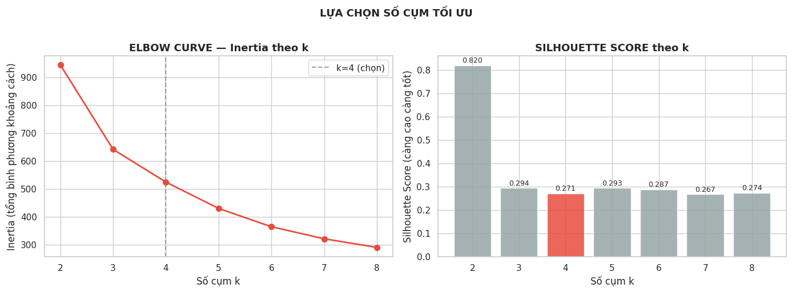

**Hình trái — Elbow Curve (Inertia):**

Inertia = tổng khoảng cách từ mỗi điểm đến tâm cụm gần nhất. Inertia càng thấp thì các điểm trong cụm càng sát nhau — tức là cụm càng "chặt".

- k=2: Inertia cao (~940) — chỉ 2 cụm, mỗi cụm ôm quá nhiều điểm xa
- k=3: giảm mạnh (~645)
- k=4: giảm thêm nhưng **tốc độ giảm bắt đầu chậm lại** (~524) — đây là điểm "khuỷu tay"
- k=5 trở đi: tiếp tục giảm nhưng chậm hơn nhiều, thêm cụm không được nhiều

> **Hiểu nôm na:** Giống như bạn thuê nhân viên. Thuê thêm người thứ 5 vẫn giúp ích. Thuê thêm người thứ 6, 7 thì năng suất thêm ít dần. k=4 là điểm "đáng tiền nhất".

**Hình phải — Silhouette Score:**

Silhouette Score đo từng điểm dữ liệu: điểm này "thuộc về" cụm của mình bao nhiêu so với cụm khác. Từ −1 đến 1, càng cao càng tốt.

- k=2: **0.820** — cao nhất, nhưng chỉ 2 cụm thì quá thô, không phân biệt được các hành vi khác nhau
- k=3: 0.294
- **k=4: 0.271** — cột màu đỏ (được chọn)
- k=5: 0.293 — **cao hơn k=4 một chút**

> ⚠️ **Lưu ý quan trọng:** k=4 không phải là k tốt nhất theo Silhouette Score. k=2 và k=5 đều cao hơn về mặt số học. Nhưng k=4 được chọn vì **Elbow + ý nghĩa nghiệp vụ** — 4 nhóm có tên và hành vi rõ ràng, còn k=2 quá thô và k=5 thì không có cụm thứ 5 nào có ý nghĩa.

---

### Hình 2 — `metrics-clustering.png`
### So sánh 4 Metrics tại k = 2 → 7

**Đây là hình gì?**
4 biểu đồ đường, mỗi cái đo một chỉ số khác nhau. Đường kẻ đứt = k=4.

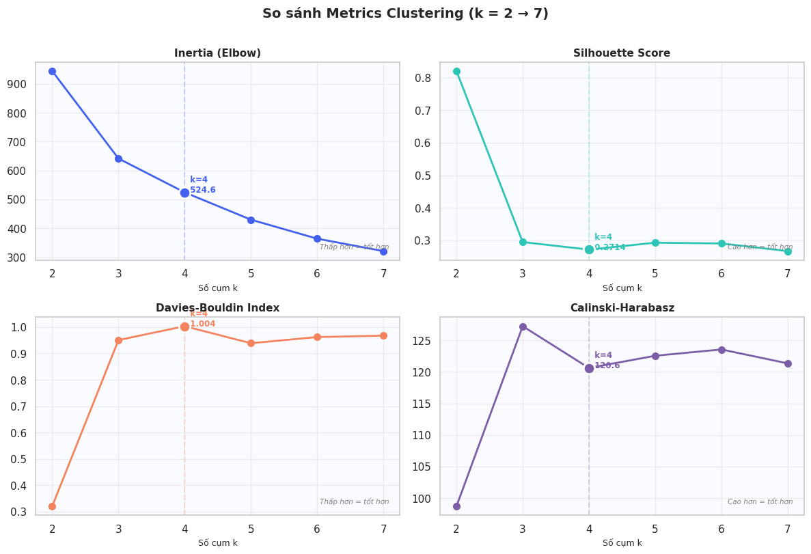

**4 ô lần lượt:**

**Ô 1 — Inertia (Elbow):**
Giống hình trái ở trên. Giảm mạnh từ k=2 đến k=4, chậm lại sau đó.

**Ô 2 — Silhouette Score:**
k=4 = 0.2714. Như đã nói, không phải đỉnh cao nhất (k=5 = 0.293 cao hơn một chút).

**Ô 3 — Davies-Bouldin Index (thấp hơn = tốt hơn):**
- k=2: **0.32** — tốt nhất
- k=4: **1.004** — **điểm cao nhất** trong toàn dải k=2..7
- Càng thấp càng tốt → k=4 là **tệ nhất** theo chỉ số này

> Davies-Bouldin = tỷ lệ "độ phân tán nội cụm" / "khoảng cách giữa tâm cụm". k=4 tệ hơn k=2 vì dữ liệu thực tế có nhiều ca giao thoa — không phải tất cả C1 và C3 đều tách bạch hoàn toàn.

**Ô 4 — Calinski-Harabasz (cao hơn = tốt hơn):**
- k=3: **128** — cao nhất
- k=4: **120.6** — thấp hơn một chút
- k=5, 6, 7: dao động quanh 120–123

> **Tóm tắt thực lòng:** Không có k nào thắng tất cả 4 chỉ số cùng lúc. k=4 được chọn vì Elbow rõ ràng và 4 cụm có ý nghĩa vận hành — đây là quyết định kết hợp thống kê + domain knowledge, không phải 1 chỉ số duy nhất nói "k=4 là tốt nhất".

---

## NHÓM 2 — ĐÁNH GIÁ CHẤT LƯỢNG

---

### Hình 3 — `silhouette-analysis.png`
### Silhouette Analysis — Chất lượng Phân cụm từng Ca

**Đây là hình gì?**
Biểu đồ "silhouette plot". Mỗi thanh ngang = 1 ca làm việc. Thanh dài về phải = ca đó được phân cụm tốt (rõ ràng thuộc về cụm của mình). Thanh ngắn hoặc vào âm = ca đó lưng chừng, có thể thuộc về cụm khác.

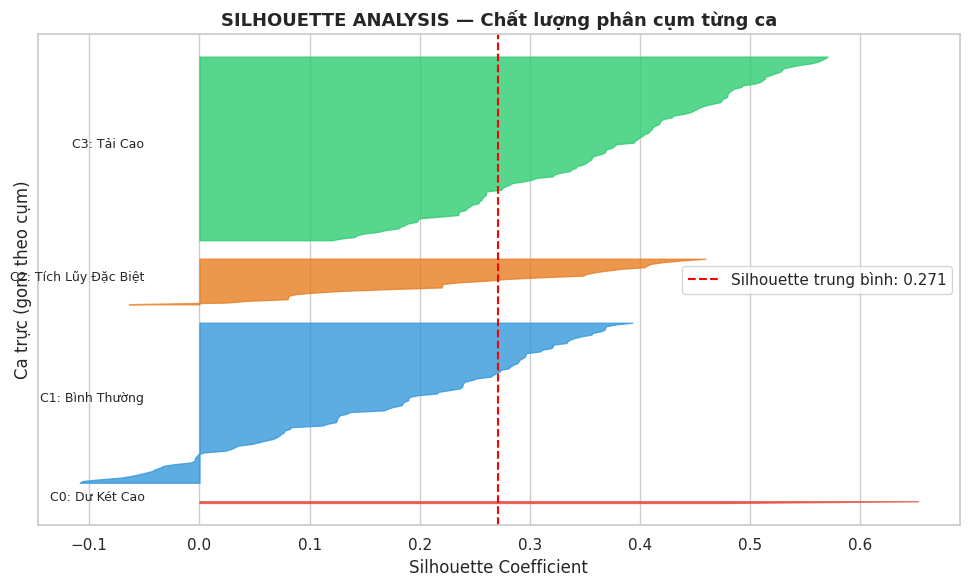

Đường đỏ đứt = Silhouette trung bình = **0.271**

**Đọc từng cụm:**

- **C3 (Tải Cao, xanh lá) — khối to nhất, nhiều ca, thanh dài nhất (~0.6):** Đây là cụm được phân loại tốt nhất. Các ca tải cao rõ ràng khác với phần còn lại.

- **C1 (Bình Thường, xanh dương) — khối to thứ hai, rải từ 0 đến 0.45:** Phần lớn các ca bình thường được xếp đúng. Một số ít ca nằm gần 0 — tức là có thể nhầm với C3 hoặc C2.

- **C2 (Tích Lũy, cam) — một số thanh âm:** Một phần nhỏ các ca C2 có Silhouette âm — nghĩa là thuật toán đã đặt nhầm chúng vào C2 trong khi thực ra chúng "gần" C1 hơn. Cụm C2 không đồng nhất.

- **C0 (Dư Két Cao, chỉ 2 ca) — đường mỏng dẹt gần 0:** 2 ca này chỉ tạo ra một đường mỏng. Silhouette gần 0 = chúng "lơ lửng" không thực sự thuộc vào cụm nào rõ ràng — nhưng DBSCAN cũng đã xác nhận chúng là outlier.

> **Hiểu nôm na:** Hãy tưởng tượng xếp học sinh vào các lớp. Lớp C3 và C1 xếp đúng rõ ràng. Lớp C2 có vài em thực ra nên ở lớp khác. Lớp C0 chỉ có 2 em đặc biệt không hẳn thuộc lớp nào — nhưng chúng quá khác biệt để nhét vào lớp chung.

---

## NHÓM 3 — KIỂM CHỨNG: Thuật toán khác có đồng ý không?

---

### Hình 4 — `k-distance-dbscan.png`
### k-Distance Graph — Cách chọn ε cho DBSCAN

**Đây là hình gì?**
DBSCAN cần 1 tham số ε (epsilon) = bán kính vùng lân cận. Hình này giúp chọn ε bằng cách "nhìn" vào khoảng cách thực tế trong dữ liệu.

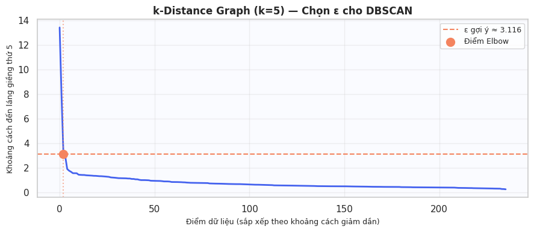

**Cách đọc:**
- Trục X: sắp xếp 236 ca theo khoảng cách giảm dần
- Trục Y: khoảng cách từ ca đó đến láng giềng thứ 5 gần nhất
- Đường màu xanh: bắt đầu cao tít (vài ca rất xa hàng xóm), rồi gãy mạnh xuống gần 0

**Điểm chọn ε:**
- Chấm cam = điểm "khuỷu tay" (Elbow) tại x ≈ 5–10
- Đường đứt cam = ε = **3.116**
- Nghĩa là: hầu hết các ca (200+ ca) có hàng xóm thứ 5 trong khoảng cách < 3.116. Chỉ vài ca đầu tiên (tít bên trái) mới cần khoảng cách > 3.116 để tìm được hàng xóm — đây là outlier.

> **Hiểu nôm na:** Hãy tưởng tượng bạn đứng giữa đám đông. Hầu hết mọi người có 5 người bạn trong vòng 3 mét. Nhưng 2 người đứng tít ngoài góc sân cần đi 10–14 mét mới tìm được 5 người bạn — đây là 2 ca outlier C0.

---

### Hình 5 — `Dendrogram.png`
### Dendrogram — Agglomerative Clustering (Ward)

**Đây là hình gì?**
Cây phân cấp (cây gia phả ngược). Bắt đầu từ dưới lên: ban đầu mỗi ca là 1 điểm riêng lẻ, thuật toán ghép dần từng cặp gần nhau nhất cho đến khi tất cả gộp thành 1 đám.

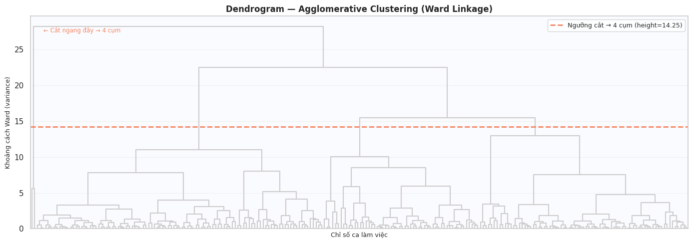

- Trục X: chỉ số ca làm việc (236 ca)
- Trục Y: khoảng cách Ward (variance) khi ghép — ghép càng tốn nhiều variance thì số trên trục Y càng cao
- Đường đứt cam nằm ngang tại **height = 14.25**

**Cách chọn số cụm:**
Vẽ 1 đường nằm ngang. Đếm số nhánh cây bị đường đó cắt = số cụm.

Tại height = 14.25, đường đứt cắt qua **4 nhánh** → 4 cụm.

Tại sao 14.25? Vì đây là điểm ngay trước 2 lần merge có "nhảy vọt" lớn nhất (từ dưới 15 lên trên 22 và lên 28). Ghép thêm sẽ tốn rất nhiều variance — tức là ghép những thứ rất khác nhau.

> **Hiểu nôm na:** Bạn cắt cây gia phả ở độ cao 14.25. Bên dưới đường cắt, mọi thứ kết nối nhau trong vòng họ hàng gần. Bên trên, 4 nhóm họ hàng lớn vẫn chưa gặp nhau. Đó chính là 4 cụm.

---

### Hình 6 — `PCA2D-Kmeans-DBSCAN.png`
### PCA 2D — K-Means (k=4) vs DBSCAN

**Đây là hình gì?**
Hai scatter plot đặt cạnh nhau, mỗi điểm = 1 ca. Trục không còn là các features gốc nữa mà là PC1 và PC2 — hai "trục ảo" giữ lại nhiều thông tin nhất khi ép từ 5 chiều xuống 2 chiều.

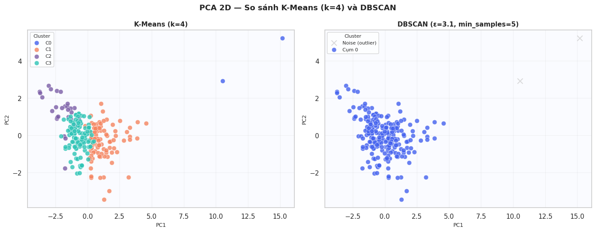

**Hình trái — K-Means (k=4):**
- Màu cam (C1 Bình Thường): đám đông lớn nhất, nằm vùng giữa
- Màu tím (C2 Tích Lũy): góc trái trên, tách biệt một chút
- Màu xanh lá (C3 Tải Cao): trộn lẫn với C1 ở giữa — ranh giới không rõ
- **2 chấm xanh dương (C0):** nằm tít ngoài cùng bên phải tại x ≈ 10 và x ≈ 15

**Hình phải — DBSCAN (ε=3.1, min_samples=5):**
- Phần lớn = Cụm 0 (xanh dương) — DBSCAN không phân biệt C1/C2/C3, gom tất cả thành 1 cụm density
- **2 dấu X (chữ thập):** nằm đúng vị trí x ≈ 10 và x ≈ 15 — đây là 2 điểm DBSCAN gán nhãn **Noise (outlier)**

> **Kết luận kiểm chứng:** 2 điểm bị DBSCAN gọi là "nhiễu" chính xác là 2 ca C0 của K-Means. Hai thuật toán hoàn toàn khác cơ chế đều đồng ý: 2 ca đó là bất thường thực sự.

---

### Hình 7 — `PCA2D-Kmeans-Agglo.png`
### PCA 2D — K-Means (k=4) vs Agglomerative Ward (k=4)

**Đây là hình gì?**
Cũng là so sánh hai scatter trên PCA 2D. Lần này K-Means vs Agglomerative Ward.

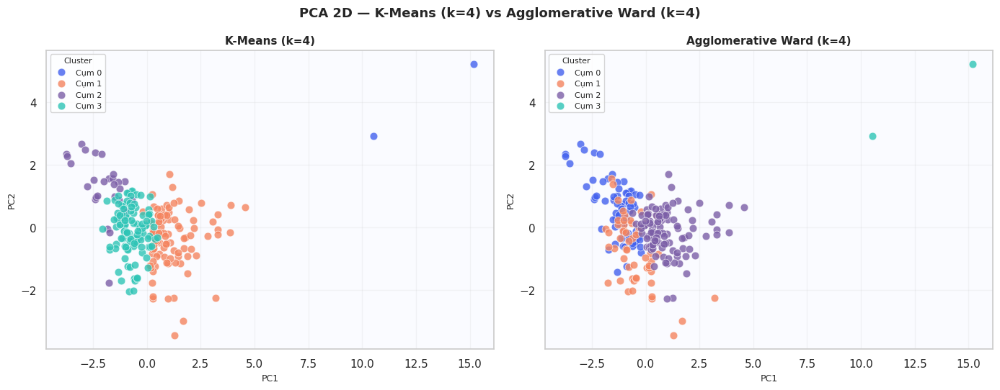

**So sánh:**
- K-Means (trái): C2 (tím) tách rõ ở góc trên trái. C3 (xanh lá) và C1 (cam) trộn nhau ở giữa.
- Agglomerative (phải): Màu tím (Cụm 2) trải rộng hơn. Màu xanh (Cụm 0) chiếm phần lớn giữa. Nhìn tổng thể: **màu sắc trộn lẫn nhau nhiều hơn** so với K-Means.

**Điểm đặc biệt:**
- 2 outlier tít ngoài: K-Means gán là C0 (xanh dương). Agglomerative gán là Cụm 3 (xanh lá). Tên khác nhau nhưng đều bị tách ra khỏi đám đông.

**ARI = 0.305:**
Adjusted Rand Index — đo mức độ đồng thuận giữa 2 cách phân cụm. 0 = ngẫu nhiên hoàn toàn. 1 = giống hệt nhau. **0.305 = đồng thuận ở mức vừa phải** — hai thuật toán không y chang nhau nhưng cũng không hoàn toàn khác.

> **Hiểu nôm na:** Hai thầy giáo độc lập chia học sinh thành nhóm. Họ không hoàn toàn đồng ý, nhưng cả hai đều đẩy những học sinh "kỳ lạ nhất" ra ngoài một nhóm riêng. Đó là tín hiệu tốt.

---

## NHÓM 4 — ĐỌC 4 CỤM LÀ GÌ

---

### Hình 8 — `radar-chart.png`
### Radar Chart — "ADN" của 4 Cụm

**Đây là hình gì?**
Biểu đồ mạng nhện (spider web). 5 trục từ tâm tỏa ra = 5 đặc trưng. Mỗi màu = 1 cụm. Đỉnh nhọn vươn ra xa = đặc trưng đó nổi bật với cụm này. Giá trị đã chuẩn hóa về 0–1.

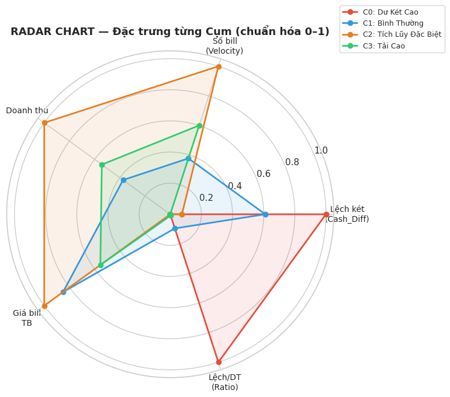

**Đọc từng cụm:**

**C0 — Đỏ — Dư Két Cao:**
- Cánh Lệch/DT (CashDiff_Ratio) vươn dài nhất tất cả → đây là đặc trưng số 1
- Cánh Cash_Diff cũng khá dài
- Số bill và Doanh thu gần tâm (gần 0)
- → Két dư rất lớn so với doanh thu, nhưng số giao dịch ít. Tiền không đến từ ca này, mà tích lũy từ trước.

**C1 — Xanh dương — Bình Thường:**
- Đa giác nhỏ, đều, nằm vùng 0.2–0.4 ở tất cả trục
- → Không có gì nổi bật. Đây là "baseline" của hệ thống.

**C2 — Cam — Tích Lũy Đặc Biệt:**
- Hai cánh Số bill (Velocity) và Doanh thu vươn dài nhất toàn bộ radar
- Cash_Diff và Ratio thấp
- → Ca rất đông khách, doanh thu lớn, nhưng két lại không lệch nhiều. Đây là các ca "siêu bận" nhưng chốt sổ cẩn thận.

**C3 — Xanh lá — Tải Cao:**
- Số bill và Doanh thu cũng cao, nhưng thấp hơn C2
- Cash_Diff thấp, tương tự C2
- → Gần giống C2 nhưng ở mức độ vừa phải hơn.

> ⚠️ Lưu ý: Theo radar chart, C2 và C3 khá giống nhau về đặc trưng tổng thể. Điểm phân biệt rõ hơn sẽ thấy ở heatmap và boxplot.

---

### Hình 9 — `heatmap-centroids.png`
### Heatmap Centroids — Giá trị chuẩn hóa của Tâm Cụm

**Đây là hình gì?**
Bảng màu 4 hàng × 6 cột. Mỗi ô = giá trị trung bình của feature đó trong cụm đó, sau khi chuẩn hóa bằng RobustScaler. Xanh đậm = cao bất thường. Vàng nhạt ≈ 0 = bình thường.

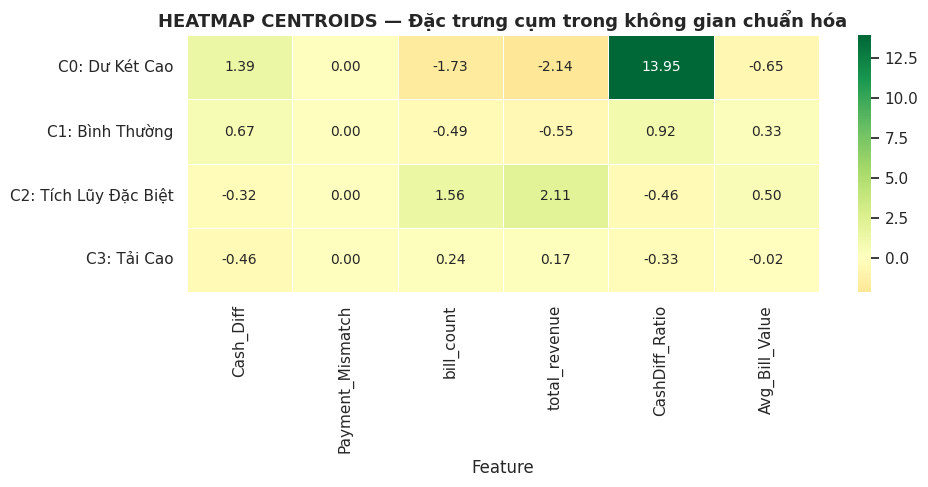

**Đọc từng hàng:**

| Cụm | Cash_Diff | Payment_Mismatch | bill_count | total_revenue | CashDiff_Ratio | Avg_Bill |
|-----|-----------|-----------------|------------|---------------|----------------|---------|
| C0 Dư Két Cao | 1.39 | 0.00 | **−1.73** | **−2.14** | **13.95 🟢** | −0.65 |
| C1 Bình Thường | 0.67 | 0.00 | −0.49 | −0.55 | 0.92 | 0.33 |
| C2 Tích Lũy | −0.32 | 0.00 | **1.56** | **2.11** | −0.46 | 0.50 |
| C3 Tải Cao | −0.46 | 0.00 | 0.24 | 0.17 | −0.33 | −0.02 |

**Điểm nổi bật:**

- **C0: CashDiff_Ratio = 13.95** — ô xanh đậm duy nhất trong toàn bảng. Giá trị này gấp 15 lần mức trung bình. Két dư gấp 13–22 lần doanh thu trong ca. Hoàn toàn bất thường.
- **C0: bill_count = −1.73 và total_revenue = −2.14** — âm sâu = ca này ít bill và ít doanh thu hơn trung bình rất nhiều.
- **C2: total_revenue = 2.11 và bill_count = 1.56** — cao hơn trung bình 2 độ lệch chuẩn. Ca siêu đông.
- **Payment_Mismatch = 0.00 toàn bộ** — cột này hoàn toàn vô nghĩa cho clustering vì bằng 0 tuyệt đối.

---

### Hình 10 — `boxplot-3.png`
### Boxplot 3 Chỉ số Chính theo Cụm

**Đây là hình gì?**
3 boxplot đặt cạnh nhau, đo 3 chỉ số khác nhau, chia theo 4 cụm màu.

**Hộp 1 — Cash_Diff:**
- C0 (đỏ): hộp nằm vùng **1.500k–1.800k** — cực cao, cao hơn tất cả
- C1 (xanh): **700k–1.500k** — phân tán rộng
- C2 (cam): **400k–900k** — vừa phải
- C3 (xanh lá): **300k–700k** — thấp nhất

**Hộp 2 — Số Bill/Ca:**
- **C0 (đỏ): hộp dẹp sát đáy ≈ 1–2 bill** — ca này gần như không có giao dịch
- **C2 (cam): hộp cao nhất, 30–50 bill** — ca siêu đông khách nhất
- C3 (xanh lá): 20–30 bill
- C1 (xanh): 15–22 bill

**Hộp 3 — Doanh thu:**
- **C0 (đỏ): gần 0** — doanh thu cực thấp
- **C2 (cam): 1.000k–1.750k** — cao nhất
- C3 (xanh lá): 700k–1.000k
- C1 (xanh): 400k–1.000k

> **Tổng hợp:** C0 nghịch lý — két dư cao nhất nhưng bill và doanh thu thấp nhất. C2 bận rộn nhất — bill nhiều nhất, doanh thu lớn nhất. C3 và C1 ở giữa.

---

### Hình 11 — `scatter-ratio.png`
### Phân tích Chi tiết theo Cụm: Scatter + CashDiff_Ratio

**Đây là hình gì?**
Hai hình khác nhau đặt cạnh nhau.

**Hình trái — Cash_Diff × Doanh thu:**
- Trục X = Doanh thu, Trục Y = Cash_Diff
- **2 chấm đỏ (C0):** góc trái, Cash_Diff cao (~1.300k và ~2.000k) nhưng Doanh thu thấp (<100k) — két nhiều nhưng ca không bán được gì
- **C2 (cam):** trải dài sang phải (doanh thu lớn 1.000k–2.000k), Cash_Diff vừa phải
- **C1 (xanh):** phân tán khắp nơi

**Hình phải — Phân phối CashDiff_Ratio:**
- Trục X = Cash_Diff / total_revenue (két dư bằng bao nhiêu lần doanh thu)
- Đường đứt đen = Ratio=1 (két dư = đúng bằng doanh thu)
- **C0 (đỏ): 2 cột nằm tít ngoài tại x=15 và x=22** — két dư gấp 15–22 lần doanh thu trong ca. Vô lý về mặt nghiệp vụ nếu không có tiền dồn từ ca trước.
- **C1 (xanh, 96 ca):** tập trung x=0–3
- **C2 (cam, 28 ca):** rải x=0–5
- **C3 (xanh lá, 110 ca):** tập trung x=0–2

---

## NHÓM 5 — BỐI CẢNH VẬN HÀNH

---

### Hình 12 — `PCA2D-scatter-feature.png`
### PCA 2D + Scatter Cash_Diff × Shift Velocity

**Đây là hình gì?**
Hai scatter khác nhau.

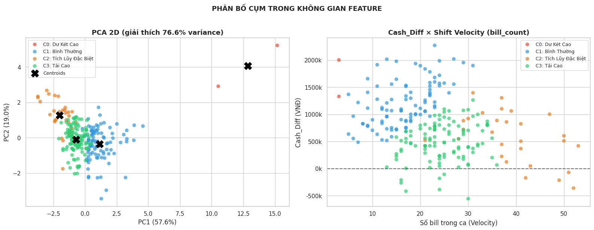

**Hình trái — PCA 2D với Centroids:**
- PC1 giải thích **57.6%** variance, PC2 = **19.0%** → tổng 76.6% được "giữ lại"
- Dấu **X đen** = 4 tâm cụm (centroid)
- **2 chấm đỏ (C0)** nằm tít xa ở x=13 và x=15 — xa đến mức không thể nhầm
- C2 (cam): góc trên trái, centroid ở PC1 âm, PC2 dương
- C1 (xanh) và C3 (xanh lá): 2 centroid gần nhau ở vùng giữa → lý do Silhouette của 2 cụm này không quá cao

**Hình phải — Cash_Diff × Shift Velocity (bill_count):**
- Trục X = Số bill trong ca, Trục Y = Cash_Diff
- **C3 (xanh lá):** tập trung vùng 20–35 bill
- **C2 (cam):** trải rộng sang vùng 35–50+ bill — ca thực sự đông hơn C3
- **C0 (đỏ):** góc trái trên — ít bill nhưng Cash_Diff cao cực đoan

---

### Hình 13 — `moring-afternoon-shift.png`
### Tỷ lệ Ca Sáng / Ca Chiều trong từng Cụm

**Đây là hình gì?**
Biểu đồ thanh ngang. 4 hàng = 4 cụm. Mỗi hàng có 2 thanh: cam = Ca Sáng, xanh lá = Ca Chiều. Tổng = 100%.

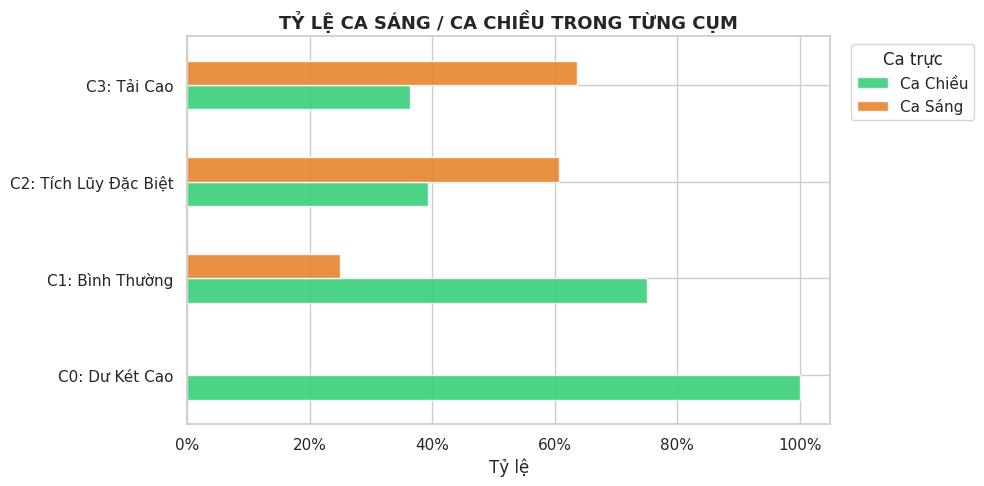

**Đọc từng hàng:**

| Cụm | Ca Sáng | Ca Chiều | Ý nghĩa |
|-----|---------|---------|---------|
| C0 Dư Két Cao | 0% | **100%** | Tất cả ca dư két cực đoan đều là Ca Chiều |
| C1 Bình Thường | ~25% | **~75%** | Ca Chiều chiếm đa số cụm bình thường |
| C2 Tích Lũy Đặc Biệt | **~60%** | ~40% | Ca Sáng nhiều hơn |
| C3 Tải Cao | **~65%** | ~35% | Ca Sáng chiếm áp đảo |

> **Giải thích thực tế:**
> - **C0 = 100% Ca Chiều:** Ca Chiều nhận được tiền từ Ca Sáng chưa nộp → két bị dồn vào
> - **C3 Tải Cao = Ca Sáng áp đảo:** Buổi sáng đông khách hơn → áp lực giao dịch cao, dễ thối nhầm tiền

---

### Hình 14 — `cluster-distribution-overtime.png`
### Phân bố Cụm theo Thời gian

**Đây là hình gì?**
Hai hình xếp dọc.

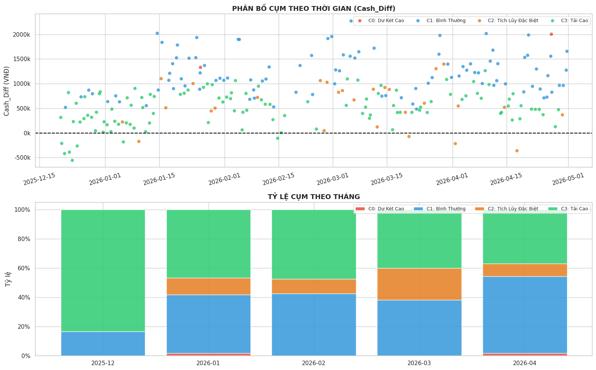

**Hình trên — Scatter theo thời gian:**
- Trục X = ngày tháng (12/2025 đến 05/2026)
- Trục Y = Cash_Diff
- Mỗi màu = 1 cụm
- **Nhận xét:** Tất cả 4 màu rải đều từ đầu đến cuối trục thời gian. Không có màu nào "nổi lên" vào một giai đoạn cụ thể.

**Hình dưới — Stacked bar theo tháng:**
- Mỗi cột = 1 tháng, tổng = 100%
- C3 xanh lá chiếm ~35–50% mỗi tháng — ổn định
- C1 xanh dương: ~20–40%
- C2 cam: ~10–20%, dao động
- C0 đỏ: lát mỏng đến mức gần như không thấy

> **Kết luận:** Không có tháng nào đặc biệt "tệ" hay "tốt". Các cụm rủi ro xuất hiện đều đặn quanh năm → đây là đặc điểm cố hữu của cách vận hành, không phải biến động thời vụ.

---

## ✅ Bảng tóm tắt 4 cụm — Dán lên tường cũng nhớ được

| Cụm | Tên | Số ca | Đặc điểm | Ca trực | Cảnh báo |
|-----|-----|-------|-----------|---------|---------|
| **C0** | Dư Két Cao | **2** | Két dư 15–22× doanh thu. Ít bill. Doanh thu thấp. | 100% Chiều | ⚠️ Tiền tích lũy từ nhiều ca, chưa nộp |
| **C1** | Bình Thường | **96** | Tất cả chỉ số gần trung bình | 75% Chiều | ✅ Vận hành chuẩn |
| **C2** | Tích Lũy Đặc Biệt | **28** | Bill nhiều nhất, doanh thu lớn nhất | 60% Sáng | ⚠️ Ca siêu bận, cần kiểm tra thủ công |
| **C3** | Tải Cao | **110** | Bill và doanh thu cao, Cash_Diff thấp | 65% Sáng | ⚠️ Ca đông khách, dễ thối nhầm tiền |
